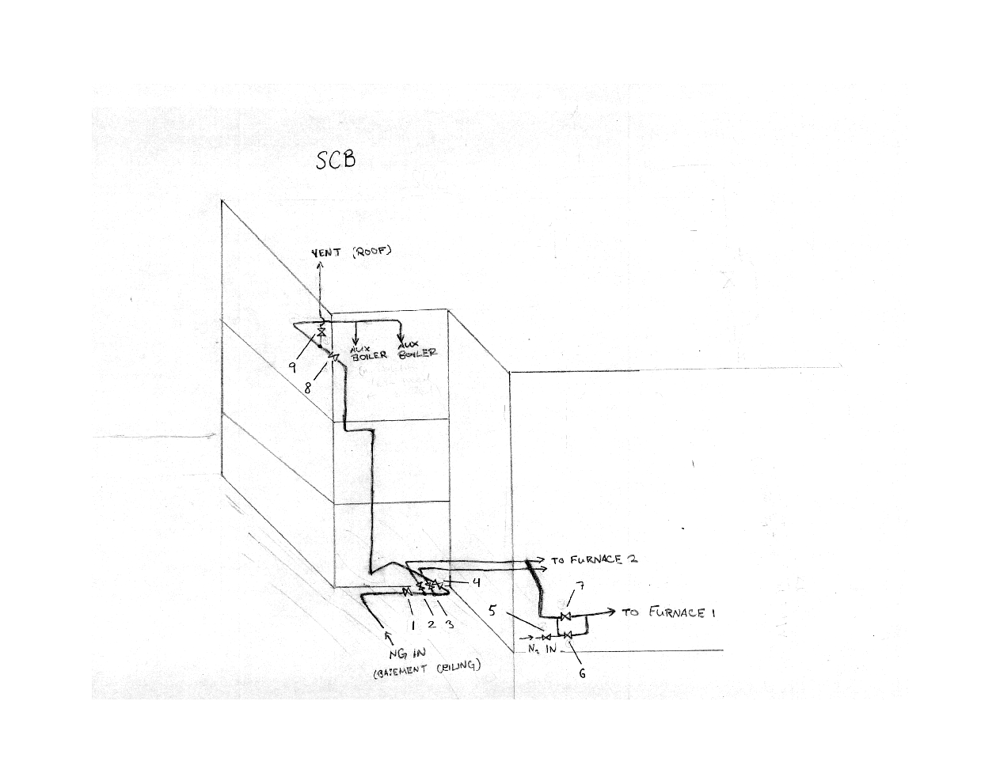

 

# Purge Procedures for Fuel Gas Piping

For SCB Furnace 1 Natural Gas Valve Replacement Work

## Purpose

These purge procedures must be performed prior to servicing fuel gas equipment and after servicing, before operation of equipment, to eliminate the risk of natural gas explosion.

## Safety

* Natural gas (methane) is flammable and explosive at concentrations greater than 5.3%.
* Monitor methane levels and ensure that there are no ignition sources, including flames, pilot lights, and electrical switchgears within 25 ft of purge inlet and venting point. All electronic devices used must be *intrinsically safe* for use in hazardous environments.
* Nitrogen and natural gas can displace oxygen in the air, causing asphyxiation. Monitor oxygen levels at purge inlet work area and avoid venting indoors or into confined space. 
* Hearing protection is required in the solids conditioning building (SCB).

## Supplies

* 2 gas detectors (sniffers) capable of measuring oxygen content and percent LEL (lower explosive limit) for methane.
* 2 fire extinguishers, suitable for fuel gas fires (Class B)
* Purge gas (nitrogen) cylinders with regulator assembly, with at least 350 cu. ft. of nitrogen gas.
* Hose for nitrogen gas with proper adapters
* Ladder, if needed for operating valves
* *Intrinsically safe* two-way radio or other safe method of communication between workers at venting point and purge inlet.

## Personnel and Responsibilies

* 2 - monitor LEL and oxygen at venting point
* 1 - operate piping valves as necessary
* 1 - operate purge gas

## Piping Diagram

The following procedures will refer to valves numbered in the diagram below.

## Site Preparation

Step | Action
---- | ----------------------------------
1 | Notify operations before beginning work.
2 | Fully close valve 1 and lock out/tag out.
2 | Remove all ignition sources within 25 feet of work areas. 
3 | Place signage to indicate fire hazard near venting point.
4 | Place one Class B fire extinguisher at purge inlet and one at venting point. 
5 | Station two workers with gas detectors, one at purge inlet and one at venting point.

## Purge Procedure

Step | Action
---- | ----------------------------------
1 | **Properly prepare site** newline
1 | Ensure that valve 1 is fully closed and locked out. Fully close valves 5, 6, 7, and 8. Open valves 2, 3, and 4.
2 | Set the regulator to provide a flowing pressure of 2 psig. Attach the regulator assembly to a nitrogen cylinder.
3 | Connect nitrogen cylinder to piping at purge inlet point. 
4 | Record the reading of the cylinder pressure gauge.
5 | Slowly open the valve at the outlet of the line pressure gauge.
6 | Leak test all connections from the nitrogen cylinder to the piping.
7 | Open valve 9. Slowly open valve 5 and confirm that gas flow is occurring at the venting point.
8 | Continue purging until 350 cu. ft. of nitrogen has been injected. Confirm that the gas stream exiting the venting point contains less than 10% of LEL (<0.5% methane concentration). 
9 | Close valve 5, then valve 9.
10 | Close nitrogen cylinder and disconnect hose.

